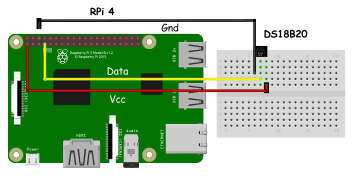
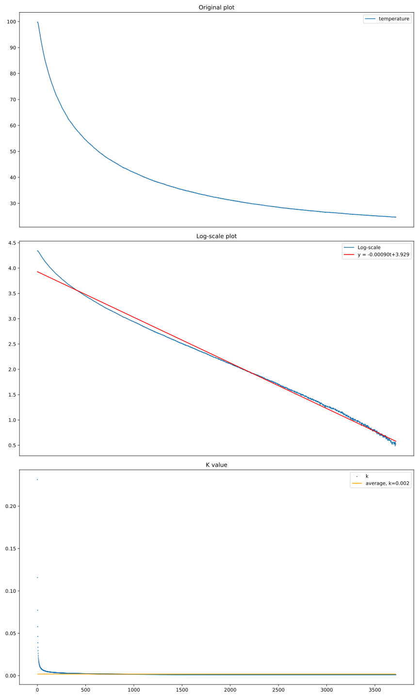
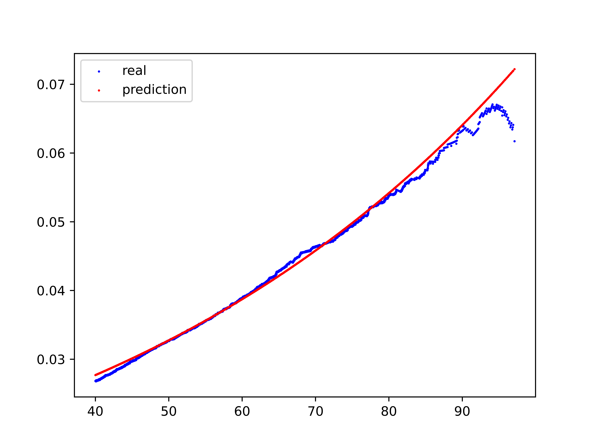
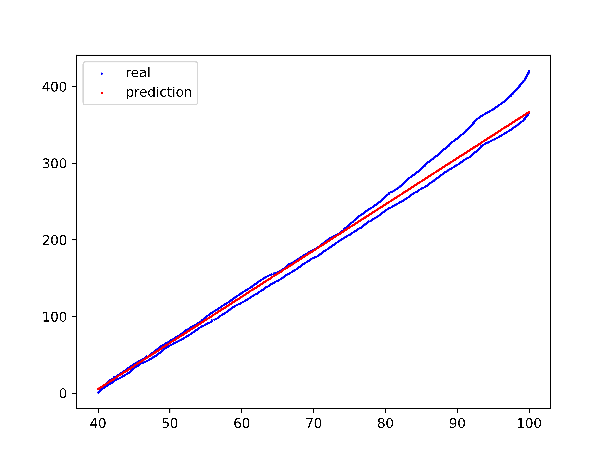

# README

## Introduction

In this project, we're going to measure time using some physics phenomenon. We choose to
use [Newton's law of cooling](https://en.wikipedia.org/wiki/Newton%27s_law_of_cooling) as the basics to figure out the
time.

## Set up the environment

```shell script
$ pip install -r requirements.txt
```

1. Push `tools` and `sensor.py` to RPI
2. The circuit should be set up:
<p align="center">
  
</p>


## Experiments

To find k, we test it different ways:

* Finding the mean of k
* Using linear regression in log-scale

  <br/>
  <p align="center">
    
  </p>

## Configuration

```python
K: float = 0.02  # Constant for the Newton Law of cooling
T_s: float = 23.0  # Surrounding temperature
T_initial: float = 100.0  # Initial temperature

HOST: str = "<address of RPi>"
PORT: str = "<Port to be used>"
```

## Training

The training file is located in `train` folder. The default value is listed below.

```shell
$ python train/train.py \
    --file_name exp/colling.csv \
    --weight exp/model.pt
```

> For more training arguments, please see `train/train.py`

The training process will be like:

```
Epoch 1: 100%|██████████████████████████████████████████████| 465/465 [00:00<00:00, 1301.83it/s, Loss: 1.394]
Epoch 2: 100%|██████████████████████████████████████████████| 465/465 [00:00<00:00, 1259.02it/s, Loss: 0.867]
...
```

<p align="center">
  
</p>


## Running code

To successfully activate the code, both `clock.py` and `server.py` should be started:
> Note: `sensor.py` or `sensor_sim.py` should be run first

```shell
# For simulation
$ python sensor_sim.py
$ python clock.py
``` 

```shell
# For cooling
$ python sensor.py
$ python clock.py --mode <mode>
```

```shell
# For heating
$ python sensor.py
$ python clock.py --mode model --heating --weight exp/heating.pt
```

The result would be like

<p align="center">
    
</p>