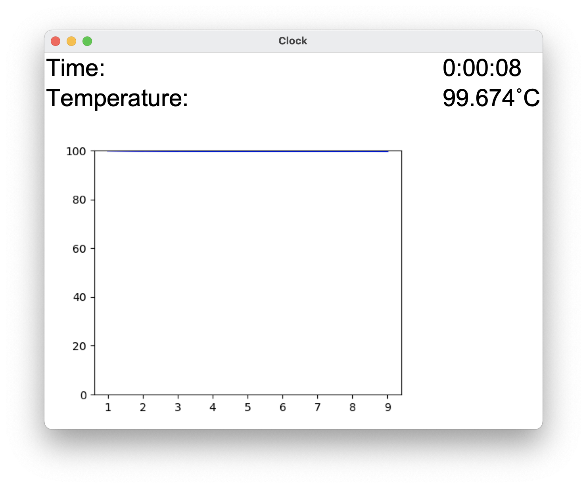

# README

## Introduction
In this project, we're going to measure time using some physics phenomenon. We choose to use [Newton's law of cooling](https://en.wikipedia.org/wiki/Newton%27s_law_of_cooling) as the basics to figure out the time.

## Set up the environment
```shell script
$ pip install -r requirements.txt
```

## Configuration
```python
K: float = <constant>
T_s: float = <surrounding temperature>
T_initial: float = <intial temperature>

HOST: str = "<address of RPi>"
PORT: str = "<Port to be used>"
```

## Running code
To successfully activate the code, both `clock.py` and `server.py` should be started:
> Note: `clock.py` should be run first
```shell script
# For simulation
$ python clock.py
$ python sensor_sim.py

# For true running
$ python clock.py
$ python sensor.py
``` 

The result would be like

<p align="center">

</p>